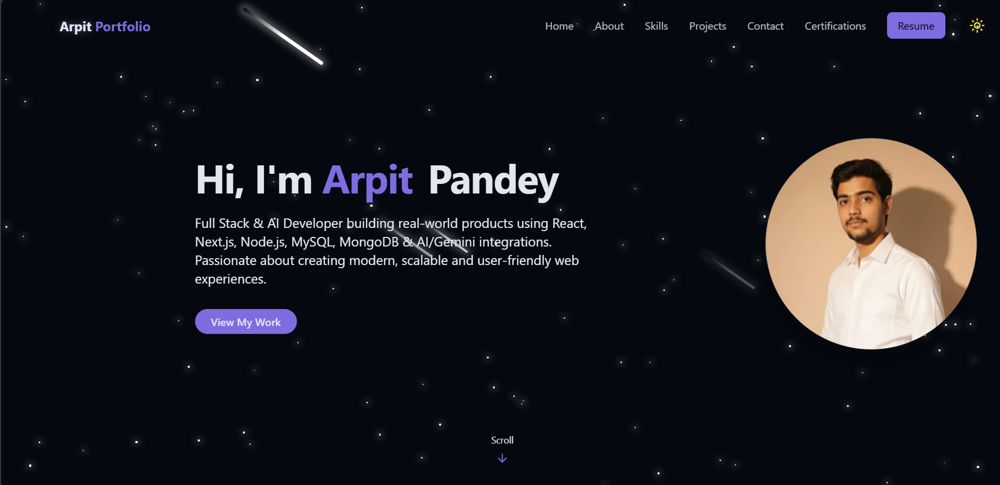
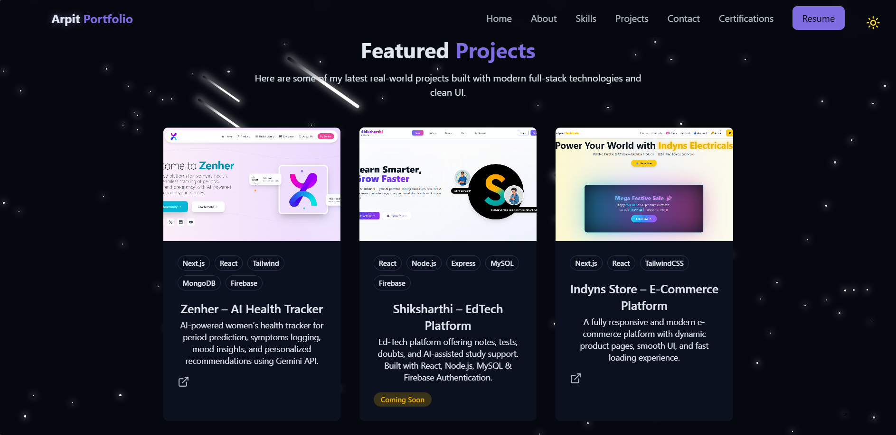

# 🌐 Arpit Portfolio

A modern and fully responsive **Personal Portfolio Website** built using  
**React + Tailwind CSS + Vite + Framer Motion**, designed to showcase my  
projects, skills, certifications, and experience.

🔗 **Live Demo:**  
https://arpit-portfolio.vercel.app

---

## 📸 Project Preview

### 🖼 Screenshot 1

### 🖼 Screenshot 2

---

## 🚀 Tech Stack

### **Frontend**
- ⚛️ React.js  
- 🎨 Tailwind CSS  
- 🎬 Framer Motion  
- ⚡ Vite  
- 🧩 React Icons  
- 🎯 Lucide Icons  

### **Backend / APIs (Used in skills & future integration)**
- 🌐 REST APIs  
- 🔐 Firebase Auth  
- 🤖 Gemini API  
- 🤖 ChatGPT API  

### **Database**
- 🍃 MongoDB  
- 🐬 MySQL  

### **Tools**
- 🐙 Git & GitHub  
- 🐳 Docker  
- 🧪 Postman  
- 🧱 VS Code  

---

## ✨ Features

- Fully responsive modern UI  
- Hero section with animated profile image  
- About section  
- Skills section with categorized filters + icons  
- Projects showcase  
- Certifications gallery with **download button**  
- Contact form with toast notification  
- Dark + Light theme support  
- Smooth animations  
- Clean folder structure  

---

---

## 🚀 Deployment

Deployed on **Vercel**  
Easy CI/CD — auto deploy on every push.

---

## 📬 Contact Me

- 📧 Email: arpitpandey1439@gmail.com  
- 🔗 LinkedIn: https://linkedin.com/in/arpit-pandey  
- 🐙 GitHub: https://github.com/IamArpitPandey  
- 📱 Instagram: https://instagram.com/iamarpitpandey  

---

## ⭐ Show Support

If you like this project, consider giving it a ⭐ on GitHub!

## 📁 Folder Structure

